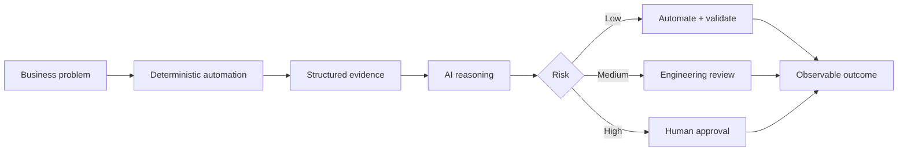

# Rabindra Rizal — AI × Analytics × Enterprise Systems

> **I build intelligent systems for enterprise decisions.**

Technology and program leader working across enterprise analytics, automation and responsible AI — from problem framing and architecture through engineering, governance, adoption and measurable outcomes.

## Featured builds

| Build | What makes it interesting | Proof of thinking |
| --- | --- | --- |
| **[Power BI Intelligence Hub](case-studies/power-bi-intelligence-hub.md)** | Treats Power BI as an engineering system that can be parsed, scored, explained and safely improved | Evidence-first architecture · deterministic validation · AI reasoning · risk-based remediation · human approval |
| **[Nagrik Resolve](case-studies/nagrik-resolve.md)** | Turns a broken citizen-service record journey into a guided, recoverable workflow | Synthetic-data safety · verified rule packs · failure recovery · accessibility · reusable service adapters |
| **[Live professional portfolio](https://robzal77.github.io/rabindra-portfolio/)** | Evidence-led view of enterprise systems and measurable outcomes | Product thinking · analytics engineering · adoption · program leadership |

### My operating model for AI



Useful AI is not a feature badge. My preferred architecture gives deterministic systems authority over facts, uses AI where interpretation and judgment add value, and keeps humans authoritative for material decisions.

## Selected enterprise evidence

| System / Program | What changed | Evidence |
| --- | --- | --- |
| Global sustainability reporting | Manual multi-zone reporting evolved toward a governed data product | **90% less manual effort** · **97% reported accuracy** · audit-ready controls |
| Analytics operating model | Code-native BI standards, health scoring, documentation and reusable assets combined into one delivery system | **~7 FTE annual value** · **40% less fragmentation** · **67% less recurring work** |
| Europe Daily Sales | Qlik-to-Power BI modernization with adoption and quality feedback loops | **13h → 2h refresh** · **260+ daily views** · **NPS 46 → 81** |

## What I build

```text
Enterprise problem
      ↓
Product / operating model
      ↓
Data + analytics architecture
      ↓
Automation / AI intelligence
      ↓
Governance + human controls
      ↓
Adoption
      ↓
Measured business outcome
```

My GitHub is intentionally not a gallery of dashboards or toy AI demos. The projects here focus on the **systems behind the output**: contracts, evidence, models, rules, orchestration, testing, risk controls and the operating model required for something to remain useful after launch.

## Technical and product themes

`Power BI` · `Microsoft Fabric` · `PBIP` · `TMDL` · `PBIR` · `Databricks` · `ADF` · `SQL` · `Python` · `TypeScript` · `Git` · `Analytics Engineering` · `Agentic Workflows` · `Governance` · `Testing` · `Product Thinking` · `Program Leadership`

## Explore

- **Portfolio:** https://robzal77.github.io/rabindra-portfolio/
- **Recruiter résumé:** https://robzal77.github.io/
- **LinkedIn:** https://www.linkedin.com/in/rabindrarizal
- **Power BI Intelligence Hub case study:** [Read the architecture →](case-studies/power-bi-intelligence-hub.md)
- **Nagrik Resolve case study:** [Read the product journey →](case-studies/nagrik-resolve.md)

## About this repository

Built with **Astro** and deployed through GitHub Pages. The implementation is deliberately compact so the narrative, evidence and product thinking remain easy to inspect and maintain.

```bash
npm install
npm run dev
npm run build
```

---

**Positioning:** I work at the intersection of product leadership, analytics engineering and applied AI — turning ambiguous enterprise problems into systems that are measurable, governable and usable after launch.
