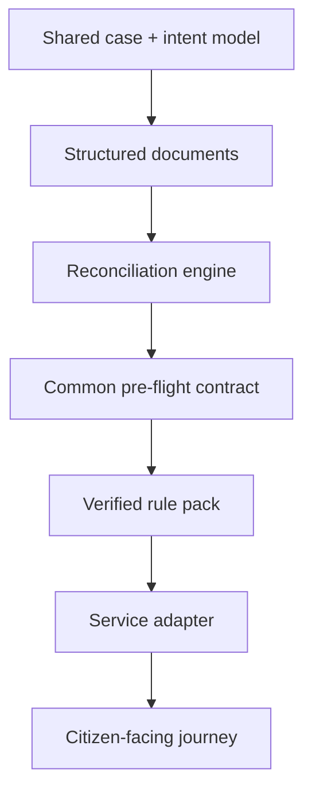

# Nagrik Resolve

> **A synthetic-data civic workflow prototype for turning confusing public-service record problems into guided, verifiable resolution journeys.**

## The problem

Citizen-service failures are rarely just a bad form. They are often a chain of problems: mismatched records, unclear evidence requirements, low-confidence document interpretation, failed validation, confusing status messages, and uncertainty about what to do next.

**Nagrik Resolve** explores how a digital product can guide a citizen through that chain while keeping the system deterministic, explainable and safe.

## Product journey


The implemented prototype uses a family-assisted Electoral/Form 8 scenario and a lightweight EPFO scalability proof, entirely with synthetic fixtures.

## What makes the design interesting

The system separates a **shared platform core** from service-specific rules and adapters.



This allows the workflow pattern to scale without pretending every government service follows the same rules.

## Trust boundaries

The prototype deliberately avoids several shortcuts that would make a demo look more magical but less trustworthy:

- No real citizen data.
- No real government endpoint.
- No real submission.
- No arbitrary file upload.
- No hidden AI decision-maker determining eligibility.
- Deterministic rules govern readiness and state transitions.
- Synthetic adapters model the boundary to an external service.

## Failure is part of the product

One of the strongest design choices is that the golden path intentionally includes an evidence failure.

Instead of ending at “submitted successfully,” the journey demonstrates:

`Submit → evidence rejected → explain why → replace evidence → revalidate → resubmit → resolve`

That matters because real operational products are judged less by their happy path and more by how clearly they help people recover when something goes wrong.

## Accessibility and usability

The product was progressively refined into a mobile-first citizen experience with:

- compact state-driven stages;
- readable-text preference support;
- record-comparison views;
- provenance / “how we checked this” explanations;
- citizen-language status messages;
- keyboard and focus-conscious interaction patterns;
- automated WCAG 2.1 AA scanning across key journey screens.

## Platform thinking

The project is intentionally designed as a **modular monolith** rather than prematurely splitting the prototype into microservices.

The reusable layer owns:

```text
Case + intent concepts
Structured document contracts
Reconciliation
Pre-flight result shape
Audit + timeline concepts
        ↓
Verified service rule pack
        ↓
Service adapter
```

This creates a credible extension boundary while keeping a hackathon-scale product maintainable.

## What this demonstrates about my work

Nagrik Resolve demonstrates how I approach AI-era product design when the domain requires trust: start with the user problem, make state and evidence explicit, design for failure recovery, isolate domain rules, and avoid using AI where deterministic logic is more appropriate.

It combines **product thinking, workflow architecture, accessibility, testing, responsible automation and system design** rather than treating AI as the product itself.

## Status

The working implementation remains private. This page is a sanitized architecture and product case study. It contains no real citizen information, credentials, government integrations or confidential data.

---

**Role:** Product design · workflow architecture · engineering direction · trust/safety model

**Themes:** `Next.js` · `React` · `TypeScript` · `Workflow Design` · `Accessibility` · `Rule Engines` · `Testing` · `Responsible AI`
