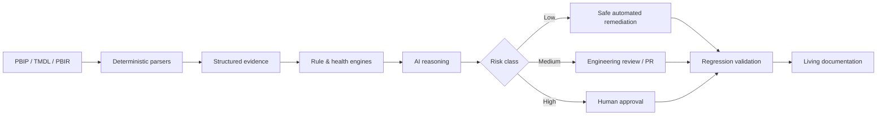
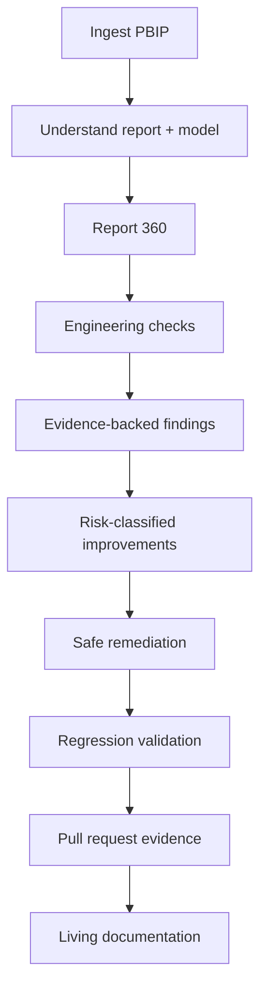

# Power BI Intelligence Hub

> **Agentic engineering intelligence for Power BI — deterministic first, AI where judgment is required, humans where risk matters.**

## Why this is interesting

Enterprise BI estates accumulate technical debt quickly: inconsistent models, unclear lineage, fragile measures, disconnected documentation, and reports that become hard to trust after the original developers move on.

The idea behind **Power BI Intelligence Hub** is to treat a Power BI solution as an engineering system that can be inspected, scored, explained and improved — not as a collection of visuals.

## The product thesis



The principle is simple:

> **Facts should come from evidence and deterministic validation. AI should interpret ambiguity, explain, prioritize and reason. Human approval remains authoritative for material changes.**

## What the system is designed to do

- Parse Power BI Project artifacts such as PBIP, TMDL and PBIR.
- Build a structured **Report 360** view of a report and semantic model.
- Inspect model quality, DAX, report UX, accessibility, performance, security, governance and maintainability.
- Attach evidence to every finding rather than outputting generic AI commentary.
- Produce a multi-domain health score instead of a single opaque rating.
- Classify remediation by risk.
- Apply deterministic low-risk fixes only when validation allows it.
- Run regression checks after changes.
- Generate PR-ready evidence and living technical documentation.

## Why the architecture is different

Many agentic demos make the agent the source of truth. This design deliberately does the opposite.

### Authority hierarchy

1. **Source evidence**
2. **Deterministic validator / test**
3. **AI reasoning**
4. **Human approval**

Multiple agents agreeing with each other is not validation.

## Example engineering health model

```text
REPORT HEALTH
────────────────────────────
Model Quality          86
Performance            91
DAX Quality            82
Report UX              74
Accessibility          88
Security               95
Documentation          69
Governance              84
Maintainability        80
────────────────────────────
Overall                 83 / 100
```

Every score should be explainable through rule IDs, severity, evidence, remediation guidance and auto-fix eligibility.

## Existing-report journey



## New-report journey

The same architecture can eventually support a second flow:

`Requirement → Requirement Contract → Architecture → Semantic Model → Report → Deterministic QA → Business QA → Human Approval → Deployment`

This is important because the long-term opportunity is not merely “AI reviews Power BI.” It is a reusable engineering layer around the full BI lifecycle.

## Product principles

- **Deterministic automation before AI reasoning**
- **Contracts over free-form agent handoffs**
- **Evidence attached to every finding**
- **Risk-based remediation**
- **Human review for security, business logic, grain, source and destructive changes**
- **Git history, tests, contracts and evidence own durable state — not agents**
- **Reuse mature Power BI/Fabric tooling before building custom components**

## What this demonstrates about my work

This project sits at the intersection of **analytics engineering, AI systems, product thinking and governance**. The interesting part is not adding a chatbot to Power BI; it is redesigning the engineering lifecycle so AI can participate without becoming an unverified authority.

## Status

The underlying implementation remains private while the architecture and product thinking are shared here as a sanitized case study. No employer data, proprietary report definitions, credentials or confidential implementation details are included.

---

**Role:** Product concept · architecture · engineering operating model · AI/human-control design

**Themes:** `Power BI` · `PBIP` · `TMDL` · `PBIR` · `Python` · `Git` · `AI agents` · `Governance` · `Testing` · `Analytics Engineering`
